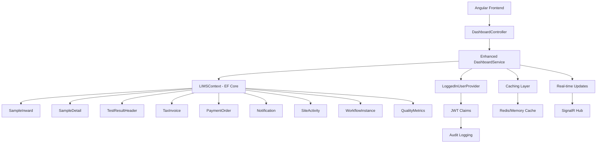

# Design Document

## Overview

This design document outlines the implementation of an enhanced, unified Dashboard backend service for the existing LIMS (Laboratory Information Management System). The solution extends the current ASP.NET Core 8 + EF Core architecture by adding a comprehensive `DashboardService` and `DashboardController` that provide complete operational and billing visibility to all authenticated users without role-based restrictions.

The enhanced dashboard system leverages existing data models, authentication infrastructure, and follows established patterns in the codebase. It provides comprehensive API endpoints that return all dashboard data including operational cards, billing information, notifications, and advanced chart data with enhanced visual design support.

## Architecture

### High-Level Architecture



### Service Layer Architecture

The enhanced dashboard follows the existing service pattern in the LIMS system with additional features:

1. **DashboardController**: REST API endpoints handling HTTP requests with comprehensive error handling
2. **IDashboardService**: Service interface defining enhanced dashboard operations
3. **DashboardService**: Implementation containing business logic, data aggregation, and caching
4. **Enhanced DTOs**: Rich data transfer objects for structured API responses with visual metadata
5. **LoggedInUserProvider**: Existing authentication context provider for audit logging
6. **Caching Layer**: Intelligent caching for performance optimization
7. **Real-time Updates**: SignalR integration for live data updates

## Components and Interfaces

### Enhanced DashboardController

```csharp
[Route("api/[controller]")]
[ApiController]
[Authorize]
public class DashboardController : ControllerBase
{
    private readonly IDashboardService _dashboardService;
    private readonly LoggedInUserProvider _userProvider;
    private readonly ILogger<DashboardController> _logger;

    [HttpGet]
    public async Task<IActionResult> GetDashboard([FromQuery] DashboardFilterDto? filters = null)
    
    [HttpGet("cards")]
    public async Task<IActionResult> GetDashboardCards([FromQuery] string? category = null)
    
    [HttpGet("charts")]
    public async Task<IActionResult> GetDashboardCharts([FromQuery] string? chartType = null)
    
    [HttpGet("notifications")]
    public async Task<IActionResult> GetDashboardNotifications([FromQuery] NotificationFilterDto? filters = null)
    
    [HttpGet("summary")]
    public async Task<IActionResult> GetDashboardSummary()
    
    [HttpGet("health")]
    public async Task<IActionResult> GetDashboardHealth()
}
```

### Enhanced IDashboardService Interface

```csharp
public interface IDashboardService
{
    Task<DashboardResponseDto> GetDashboardAsync(LoggedInUserDTO userContext, DashboardFilterDto? filters = null);
    Task<List<DashboardCardDto>> GetDashboardCardsAsync(LoggedInUserDTO userContext, string? category = null);
    Task<List<DashboardChartDto>> GetDashboardChartsAsync(LoggedInUserDTO userContext, string? chartType = null);
    Task<List<DashboardNotificationDto>> GetDashboardNotificationsAsync(LoggedInUserDTO userContext, NotificationFilterDto? filters = null);
    Task<DashboardSummaryDto> GetDashboardSummaryAsync(LoggedInUserDTO userContext);
    Task<DashboardHealthDto> GetDashboardHealthAsync();
    Task InvalidateCacheAsync(string? cacheKey = null);
}
```

### DashboardService Implementation

The service implementation uses the existing `LIMSContext` and follows established patterns:

```csharp
public class DashboardService : IDashboardService
{
    private readonly LIMSContext _context;
    private readonly ILogger<DashboardService> _logger;

    // Core method that orchestrates all dashboard data
    public async Task<DashboardResponseDto> GetDashboardAsync(LoggedInUserDTO userContext)
    
    // Role-based card filtering and data aggregation
    private async Task<List<DashboardCardDto>> GetOperationalCardsAsync(LoggedInUserDTO userContext)
    private async Task<List<DashboardCardDto>> GetBillingCardsAsync(LoggedInUserDTO userContext)
    
    // Chart data aggregation methods
    private async Task<List<DashboardChartDto>> GetSampleTrendChartsAsync(LoggedInUserDTO userContext)
    private async Task<List<DashboardChartDto>> GetBillingChartsAsync(LoggedInUserDTO userContext)
    
    // Notification aggregation
    private async Task<List<DashboardNotificationDto>> GetSystemNotificationsAsync(LoggedInUserDTO userContext)
}
```

## Data Models

### Dashboard Response DTOs

```csharp
public class DashboardResponseDto
{
    public List<DashboardCardDto> Cards { get; set; } = new();
    public List<DashboardChartDto> Charts { get; set; } = new();
    public List<DashboardNotificationDto> Notifications { get; set; } = new();
    public DateTime GeneratedAt { get; set; } = DateTime.UtcNow;
}

public class DashboardCardDto
{
    public string Key { get; set; } = string.Empty;
    public string Title { get; set; } = string.Empty;
    public int Count { get; set; }
    public string Status { get; set; } = "Normal"; // Normal, Warning, Critical
    public List<string> AllowedRoles { get; set; } = new();
    public string? Description { get; set; }
    public Dictionary<string, object>? Metadata { get; set; }
}

public class DashboardChartDto
{
    public string Key { get; set; } = string.Empty;
    public string Title { get; set; } = string.Empty;
    public string ChartType { get; set; } = string.Empty; // Line, Bar, Pie, etc.
    public List<ChartDataPointDto> DataPoints { get; set; } = new();
    public List<string> AllowedRoles { get; set; } = new();
    public Dictionary<string, object>? Options { get; set; }
}

public class ChartDataPointDto
{
    public string Label { get; set; } = string.Empty;
    public decimal Value { get; set; }
    public DateTime? Date { get; set; }
    public Dictionary<string, object>? Metadata { get; set; }
}

public class DashboardNotificationDto
{
    public long Id { get; set; }
    public string Title { get; set; } = string.Empty;
    public string Message { get; set; } = string.Empty;
    public string Type { get; set; } = string.Empty; // Info, Warning, Error, Success
    public string Priority { get; set; } = "Normal"; // Low, Normal, High, Critical
    public DateTime CreatedAt { get; set; }
    public bool IsRead { get; set; }
    public string? ActionUrl { get; set; }
    public Dictionary<string, object>? Metadata { get; set; }
}
```

### Data Source Mapping

The dashboard service aggregates data from existing tables:

| Dashboard Card | Primary Table | Supporting Tables | Status Field |
|---|---|---|---|
| Pending Sample Inward | SampleInward | - | InwardStatus = "Sample Received" |
| Today's Samples | SampleInward | - | CollectionTime = Today |
| Overdue Samples | SampleDetail | SampleInward | SampleStatus != "Completed" AND Expected < Today |
| Pending Plan Approval | SampleTestPlan | SampleDetail | Status = "Pending Approval" |
| Samples Under Testing | TestResultHeader | SampleDetail | Status = "In Progress" |
| Results Pending Review | TestResultHeader | - | Status = "Completed", CompletedAt IS NOT NULL |
| Reports Pending Dispatch | ReportHeader | Report | Status = "Approved", Dispatched = false |
| Pending Invoices | TaxInvoice | SampleInward | Status = "Generated" |
| Paid Invoices | PaymentOrder | TaxInvoice | Status = "Paid" |

## Correctness Properties

*A property is a characteristic or behavior that should hold true across all valid executions of a system-essentially, a formal statement about what the system should do. Properties serve as the bridge between human-readable specifications and machine-verifiable correctness guarantees.*

### Property Reflection

After analyzing all acceptance criteria, several properties can be consolidated to eliminate redundancy:

- Properties 2.1, 2.2, 2.3 can be combined into a comprehensive role-based access property
- Properties 3.1, 3.2, 4.1 can be combined into a general card data accuracy property
- Properties 7.2, 7.3, 8.1 can be combined into a comprehensive API response property

### Core Properties

Property 1: Role-based data access control
*For any* user context with a specific role (Admin, Accounts, Normal), the dashboard service should return only data appropriate to that role, with Admin seeing all data, Accounts seeing billing and limited operational data, and Normal users seeing only operational data
**Validates: Requirements 2.1, 2.2, 2.3**

Property 2: Billing data security
*For any* user context with Normal_User_Role, the dashboard service should never return any billing or payment related data in cards, charts, or notifications
**Validates: Requirements 2.4, 4.5**

Property 3: User context validation
*For any* invalid or null user context, the dashboard service should validate the context and return appropriate errors without exposing any dashboard data
**Validates: Requirements 2.5**

Property 4: Read-only data access
*For any* dashboard operation, the service should only perform read operations and never modify any existing business data or workflow states
**Validates: Requirements 1.4, 1.5**

Property 5: Dashboard card accuracy
*For any* dashboard card (Pending Sample Inward, Today's Samples, Pending Invoices), the count should accurately reflect the current state of the corresponding data in the database based on the specified status and date filters
**Validates: Requirements 3.1, 3.2, 4.1**

Property 6: Urgent sample highlighting
*For any* sample marked as urgent or express, the dashboard should include special status indicators in the appropriate cards and notifications
**Validates: Requirements 3.8**

Property 7: API endpoint functionality
*For any* authenticated request to GET /api/dashboard, the controller should detect the user role from JWT claims and return structured JSON containing cards, charts, and notifications arrays
**Validates: Requirements 7.2, 7.3**

Property 8: DTO structure consistency
*For any* dashboard response, the DTOs should have the required structure (DashboardResponseDto with Cards, Charts, Notifications arrays) and be serializable to valid JSON
**Validates: Requirements 8.1, 8.5**

Property 9: Authentication error handling
*For any* request with invalid or missing user context, the dashboard controller should return HTTP 401 Unauthorized status
**Validates: Requirements 10.2**

<function_calls>
<invoke name="prework">
<parameter name="featureName">lims-dashboard-backend

## Error Handling

### Exception Handling Strategy

The dashboard service follows the existing LIMS error handling patterns:

1. **Service Layer Exceptions**: Caught and logged with detailed context
2. **Database Exceptions**: Handled gracefully with appropriate error responses
3. **Authentication Exceptions**: Return HTTP 401 with standard error format
4. **Authorization Exceptions**: Return HTTP 403 with role-specific messaging
5. **Validation Exceptions**: Return HTTP 400 with validation details

### Error Response Format

```csharp
public class DashboardErrorResponse
{
    public string Error { get; set; } = string.Empty;
    public string Message { get; set; } = string.Empty;
    public int StatusCode { get; set; }
    public DateTime Timestamp { get; set; } = DateTime.UtcNow;
    public string? TraceId { get; set; }
}
```

### Logging Strategy

The dashboard service uses the existing `ILogger<DashboardService>` infrastructure:

- **Information**: Successful dashboard requests with user context
- **Warning**: Performance issues or data inconsistencies
- **Error**: Database failures, authentication issues, or unexpected exceptions
- **Debug**: Detailed query execution and role filtering logic

## Testing Strategy

### Dual Testing Approach

The dashboard implementation requires both unit tests and property-based tests for comprehensive coverage:

**Unit Tests**: Focus on specific examples, edge cases, and integration points
- Test specific role scenarios (Admin, Accounts, Normal user)
- Test error conditions (invalid user context, database failures)
- Test DTO serialization and structure
- Test controller endpoint responses

**Property Tests**: Verify universal properties across all inputs
- Test role-based filtering across all possible user contexts
- Test data accuracy across various database states
- Test security properties with generated user contexts
- Test API response structure consistency

### Property-Based Testing Configuration

- **Framework**: Use FsCheck.NUnit for .NET property-based testing
- **Iterations**: Minimum 100 iterations per property test
- **Test Tags**: Each property test references its design document property
- **Tag Format**: **Feature: lims-dashboard-backend, Property {number}: {property_text}**

### Test Data Strategy

**Test Database**: Use in-memory Entity Framework provider for isolated testing
**Data Generators**: Create realistic test data generators for:
- Sample inward records with various statuses and dates
- Test results with different completion states
- Invoice and payment records with various statuses
- User contexts with different roles and permissions

### Integration Testing

**API Testing**: Test the complete request/response cycle
- Authentication middleware integration
- Role-based response filtering
- JSON serialization and structure
- HTTP status code handling

**Database Integration**: Test with realistic data volumes
- Performance under normal load conditions
- Query optimization verification
- Index usage validation

## Implementation Notes

### Service Registration

The dashboard service follows existing DI patterns in `Program.cs`:

```csharp
// Register Dashboard Service
builder.Services.AddScoped<IDashboardService, DashboardService>();
```

### Authentication Integration

The dashboard leverages existing JWT authentication:
- Uses `LoggedInUserProvider` for user context
- Integrates with existing `[Authorize]` attributes
- Follows established role claim patterns

### Database Query Optimization

**Efficient Queries**: Use database aggregation instead of in-memory processing
**Index Usage**: Leverage existing indexes on status and date fields
**Query Batching**: Combine related queries where possible
**Projection**: Select only required fields for dashboard calculations

### Caching Strategy

**Static Data**: Cache role definitions and configuration data
**Dynamic Data**: No caching for real-time operational data
**Cache Invalidation**: Use existing cache invalidation patterns if implemented

### Deployment Considerations

**Zero Downtime**: New service can be deployed without affecting existing functionality
**Backward Compatibility**: No changes to existing APIs or database schema
**Configuration**: Use existing configuration patterns for any dashboard-specific settings
**Monitoring**: Integrate with existing logging and monitoring infrastructure